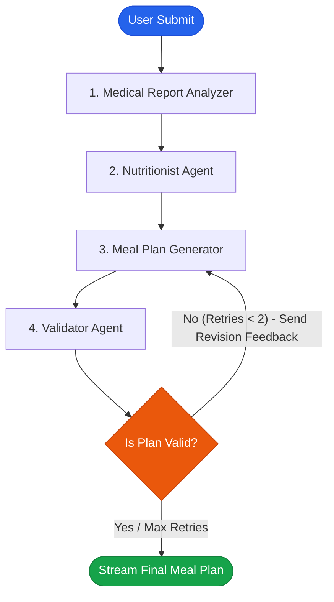

# FiTFEAST — AI Indian Meal Recommendation System 🇮🇳

FiTFEAST is a state-of-the-art, personalized Indian meal recommendation web application. Powered by a **multi-agent LangGraph orchestrator** and the **Groq API**, the system ingests user metrics (Age, Gender, Weight, Height, Health Conditions, Allergies, and Diet Preferences), parses uploaded medical report PDFs, designs a custom 7-day Indian meal plan, and validates it for clinical safety.

---

## 🌟 Key Features

* **Multi-Agent Orchestration**: Compiled state-graph workflow utilizing 4 specialised cooperative AI agents using **LangGraph**.
* **Upgraded Model**: Powered by **`llama-3.3-70b-versatile`** (with automatic fallback to `llama-3.1-8b-instant`), optimized for complex reasoning, structural formatting, and high rate-limit resilience.
* **Graceful Rate-Limit Retries**: Backed by a robust request scheduler with regex wait parsing and exponential backoff to handle rate limits without application crashes.
* **Medical Report Analysis (PDF)**: Securely extracts text from user-uploaded blood test results, prescriptions, or lab reports to dynamically adjust nutritional targets (truncated to 10k characters for stability).
* **Authentic Indian Cuisine Enforced**: Strict system prompts enforce regional Indian cuisines (North Indian, South Indian, Gujarati, Bengali, Rajasthani, etc.) and filter out Western, Chinese, or fusion dishes.
* **Closed-Loop Validation & Revision**: The *Validator* agent performs a safety audit. If any violations (allergens, macro mismatches, or non-Indian dishes) are found, it routes the plan back to the generator with feedback (revises up to 2 times).
* **Real-Time Progress Streaming**: Uses Server-Sent Events (SSE) to update the frontend stepper UI on the server's progress in real-time.

---

## 📐 System Architecture & Multi-Agent Flow

The orchestrator manages a `StateGraph` passing a shared `MealPlanState` dictionary sequentially:



### The 4 Agents
1. **🔍 Agent 1 — Medical Report Analyzer**: Extracts markers from health documents and maps clinical constraints to Indian dietary patterns.
2. **📊 Agent 2 — Nutritionist**: Computes calorie intake and macro targets (Protein, Carbs, Fats) using the Mifflin-St Juor equation.
3. **🍛 Agent 3 — Meal Plan Generator**: Creates a structured, regional 7-day menu matching macro limits and allergy boundaries.
4. **🛡️ Agent 4 — Validator**: Audits the generated plan for allergens, fusion dishes, and medical compliance.

---

## 🛠️ Technology Stack

| Component | Technology | Description |
| :--- | :--- | :--- |
| **Frontend** | HTML5, Tailwind CSS, Vanilla JS | Interactive stepper UI, SSE client, and customized day tables. |
| **Backend Framework** | Flask (Python) | Server routing, file upload handling, and SSE stream API. |
| **AI Orchestration** | LangGraph | State machine architecture managing the sequence of agents and revision loops. |
| **LLM Provider** | Groq API | High-speed orchestrated model execution. |
| **Active Model** | `llama-3.3-70b-versatile` | State-of-the-art Meta Llama model on Groq with fallback. |
| **PDF Extraction** | PyPDF | Local, secure text extraction from medical documents. |

---

## 💻 Local Setup & Execution

### Prerequisites
* Python 3.10 or 3.11
* Groq API Key (from [console.groq.com](https://console.groq.com/))

### Steps

1. **Clone the Repository**:
   ```bash
   git clone https://github.com/Shresth-11/Indian_meal_recommendation_system.git
   cd Indian_meal_recommendation_system
   ```

2. **Set up Virtual Environment**:
   ```bash
   python -m venv venv
   # On Windows:
   ./venv/Scripts/activate
   # On macOS/Linux:
   source venv/bin/activate
   ```

3. **Install Dependencies**:
   ```bash
   pip install -r requirements.txt
   ```

4. **Add Environment Variables (`.env`)**:
   Create a `.env` file in the root folder and add your key:
   ```env
   # Groq API Key
   GROQ_API_KEY=gsk_your_actual_key_here

   # Flask settings
   FLASK_ENV=development
   FLASK_DEBUG=True
   ```

5. **Run the Server**:
   ```bash
   python run.py
   ```
   Open your browser to **`http://127.0.0.1:5000`**.

---

## ☁️ Deployment

### Option 1: Hugging Face Spaces (Recommended Free Host)
This repository includes a pre-configured `Dockerfile` for Hugging Face Spaces:
1. Create a new Space on [Hugging Face Spaces](https://huggingface.co/new-space).
2. Select **Docker** as the Space SDK (Blank).
3. Set your Space to **Public**.
4. In Space **Settings** -> **Variables and secrets**, add a new secret:
   - Name: `GROQ_API_KEY`
   - Value: `gsk_your_groq_api_key_here`
5. Push this repository to your Space:
   ```bash
   git remote add space https://huggingface.co/spaces/<YOUR_HF_USERNAME>/<YOUR_SPACE_NAME>
   git push space main
   ```

### Option 2: Render
This project can also be deployed directly to **Render** as a Python Web Service.

* **Runtime/Language**: `Python 3`
* **Build Command**: `pip install -r requirements.txt`
* **Start Command**: `gunicorn run:app`
* **Environment Variables**: Add `GROQ_API_KEY` under Render's Environment tab.
